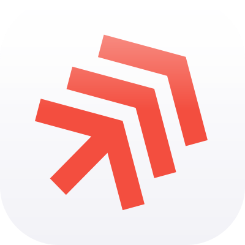

# Agent Skills

[](https://skills.sh/D1ZZY4/agent-skills)

Reusable skills for coding agents. Each skill is a normal directory with `SKILL.md` plus optional `references/`, so you can copy or symlink it into any Agent Skills compatible directory.

## Install

First list the skills this repository provides:

```bash
npx skills add D1ZZY4/agent-skills --list
```

Install only the skills you want, one `--skill` flag per skill:

```bash
npx skills add D1ZZY4/agent-skills --skill context7-expert --skill dizzy-commit
```

Running `npx skills add D1ZZY4/agent-skills` without any `--skill` flag installs every skill at once without letting you choose. List first and name the skills you actually use, so nothing is installed unless you select it.

---
## Skills

| Skill | Category | Description |
|---|---|---|
| `context7-expert` | Documentation | Version-aware library and platform documentation lookup; auto-loads but always proposes the query to the user before running it. |
| `copywriting-expert` | Content | User-facing product and UI copy, including buttons, errors, onboarding, accessibility text, and CLI output. |
| `create-readme-expert` | Documentation | Source-driven README creation, improvement, and audit. |
| `mermaid-diagrams-expert` | Documentation | Maintainable Mermaid diagrams for software documentation. |
| `dizzy-commit` | Workflow | Repository-aware Git commit and push safety. |
| `redis-expert` | Infrastructure | Redis architecture, clients, search, clustering, observability, security, and semantic caching. |

### Documentation and content

- `context7-expert`: current, version-aware library and platform documentation lookup; auto-loads but always proposes the query to the user before running it.
- `copywriting-expert`: user-facing product and UI copy, including buttons, errors, onboarding, accessibility text, and CLI output.
- `create-readme-expert`: source-driven README creation, improvement, and audit.
- `mermaid-diagrams-expert`: maintainable Mermaid diagrams for software documentation.

### Development workflow

- `dizzy-commit`: repository-aware Git commit and push safety.
- `redis-expert`: Redis architecture, clients, search, clustering, observability, security, and semantic caching.

## Why these skills

Each skill defines its triggers, safety boundaries, and loading behavior in its own `SKILL.md`. The `context7-expert` entry below also records a full comparison against its upstream original. Differences are tracked in [CHANGELOG.md](CHANGELOG.md). The same comparison format follows for the other skills as their upstream notes land.

### context7-expert

<details>
<summary>How it works, why it is worth it, and how it differs from the official</summary>

**How it works**: the skill watches for anything that depends on an external library, framework, SDK, or cloud service, then runs a six-step flow before answering.

1. Decides whether current documentation is actually needed, and skips library-independent questions instead of treating the lookup as a ritual.
2. Picks the strongest available source: project-local docs and lockfiles first, official vendor docs second, Context7 third.
3. Chooses the available mode: the Context7 MCP when present, the `ctx7` CLI as fallback.
4. Proposes the lookup to you, including the exact library, the version, and the mode, and waits for your confirmation before any query is sent.
5. Resolves the library precisely from your manifests, fetches only the reference the task needs, and applies it without silently upgrading your dependency version.
6. Reports what was verified and what stays uncertain instead of fabricating a method, option, version, or compatibility claim.

**Why it is worth it**: model training data goes stale, and "latest" answers break projects pinned to older versions. This skill answers from current, version-matched documentation. Because every lookup is approved first, it never surprises you with token spend, never sends project details to a remote service without your explicit consent, and never invents an installation state.

**What differs from the official**: the official Context7 setup is not one skill. It ships as three separate skills in `upstash/context7` (`find-docs` for the CLI lookup flow, `context7-mcp` for the MCP flow, and `context7-cli` for full CLI coverage) plus two standalone rules files (`rules/context7-cli.md` and `rules/context7-mcp.md`). This repo replaces all five files with a single installable skill. In the table, &check; means the version covers it, &cross; means it is absent or not specified, and &bull; means it is partial or varies.

| Category | Official `upstash/context7` | This repo `context7-expert` |
|----------|----------------------------|-----------------------------|
| Packaging | &bull; 3 skills + 2 rules files; lookup mode follows the file you install (`find-docs` = CLI, `context7-mcp` = MCP) | &check; 1 skill, chooses its own mode |
| Consent before any lookup | &cross; queries run as soon as the need appears | &check; proposes query, version, and mode, then waits |
| Source priority | &bull; Context7 over web search | &bull; evidence ladder: project-local &rarr; vendor docs &rarr; Context7 |
| Version handling | &bull; optional `/org/project/version` IDs | &check; checks lockfiles and manifests, never silently swaps major versions |
| Query discipline | &bull; one concept per query, max 3 commands | &check; same rules plus budget tiers in one reference |
| Quota and auth handling | &bull; tells the user and suggests login | &check; same, plus falls back only with flagged uncertainty |
| Security and trust boundary | &bull; warns not to put secrets in queries | &check; treats fetched docs as untrusted data (W011), query redaction, npx execution policy |
| Uncertainty reporting | &cross; only for quota errors | &check; explicit verified-versus-uncertain report per lookup |
| Documentation and structure | &bull; flat, single-purpose SKILL.md bodies | &check; 10 references, loaded only for the current step |
| License | &bull; MIT licensed (see upstream LICENSE) | &check; unified SSPL-1.0 |

**Strengths**: version-accurate answers; consent-based privacy and cost control; precise, narrow fetches; a documented fallback ladder; security rules for untrusted fetched content; honest uncertainty reporting.

**Weaknesses**: every lookup needs your confirmation, which adds friction for fast, fully-autonomous workflows; it needs the MCP or the `ctx7` CLI to reach Context7 (without them it degrades to local docs and flagged uncertainty); coverage depends on the Context7 index, so new or niche libraries can be missing; and it ships ten references, so the install is larger than a single SKILL.md (progressive disclosure keeps the loaded part small).

**Proactive loading**: you never have to say a magic word. The skill auto-loads whenever the task matches a trigger, for example, a named dependency plus an API question, a version number, migration work, setup, or an error from a specific library. That is especially valuable on free or entry-tier AI models, whose default behavior is to answer from memory: the skill pulls the agent toward checking current documentation instead of hallucinating it. Auto-loading never means auto-querying: the consent gate still applies at the moment the lookup would be sent.

</details>

---
## Setup

Each skill works once its directory is inside a skills path your agent reads. The standard shape is a `SKILL.md` routing file plus optional `references/` with detailed procedures.

Preferred path: install with `npx skills add` as shown above.

Manual path: copy or symlink the skill directory into the skills directory your agent documents, then confirm the agent lists the skill. Each skill documents its own triggers and safety rules in its `SKILL.md`.

## Compatible agents

<details>
<summary>12 tools that read the Agent Skills format</summary>

| Agents |
|---|
|  Amp |
|  Antigravity |
|  Claude Code |
|  Cline |
|  Codex |
|  Cursor |
|  Gemini CLI |
|  GitHub Copilot |
|  Hermes |
|  OpenCode |
|  Pi |
|  Windsurf |

</details>

## Contributing

Want to fix a skill or propose a new one? Start with [CONTRIBUTING.md](CONTRIBUTING.md).

## License

SSPL-1.0. Copyright (c) 2026 D1ZZY4. See [LICENSE](LICENSE).
