# Class Diagrams

Class diagrams model object-oriented designs and domain models. They show entities (classes),
their attributes/methods, and relationships.

## Basic Syntax

```mermaid
classDiagram
    ClassName
```

## Defining Classes with Members

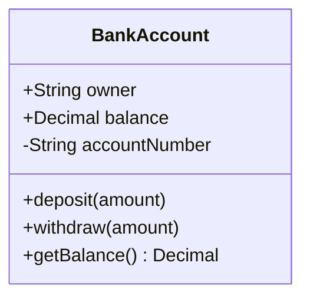

**Visibility modifiers:**
- `+` Public
- `-` Private
- `#` Protected
- `~` Package/Internal

**Member syntax:**
- `+type attribute` - Attribute with type
- `+method(params) ReturnType` - Method with parameters and return type

**Member classifiers** - Special characters after the member denote properties:
- `*` marks an **abstract** member, e.g. `+draw()*` or `+draw() int*`
- `$` marks a **static** member, e.g. `+create()$` or `String template$`

## Relationships

### Association (`--`)
Loose relationship where entities use each other but exist independently.

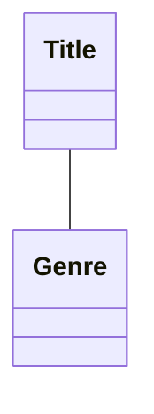

### Composition (`*--`)
Strong ownership - child cannot exist without parent. When parent is deleted, children are deleted.

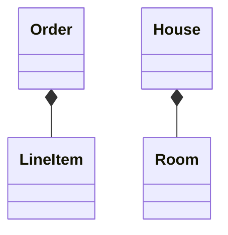

### Aggregation (`o--`)
Weaker ownership - child can exist independently. Represents "has-a" relationship.

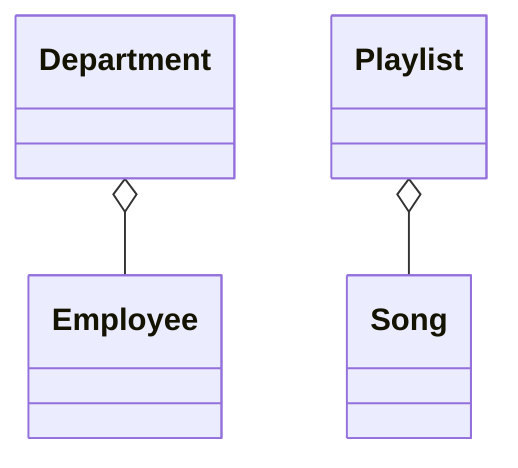

### Inheritance (`<|--`)
"Is-a" relationship. Child class inherits from parent class.

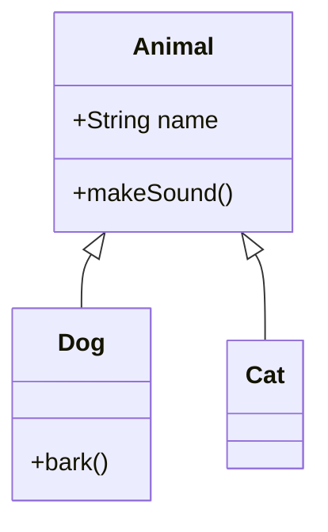

### Dependency (`..>`)
One class depends on another, often as a parameter or local variable.

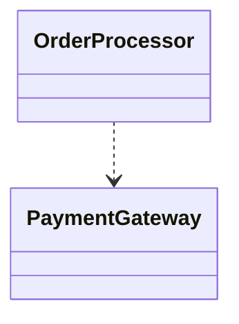

The arrow direction is reversible, so `OrderProcessor ..> PaymentGateway` is the same
relationship as `PaymentGateway <.. OrderProcessor`.

### Realization/Implementation (`..|>` or `<|..`)
Class implements an interface.

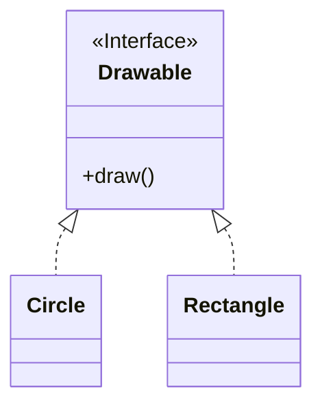

## Multiplicity

Show how many instances participate in a relationship:

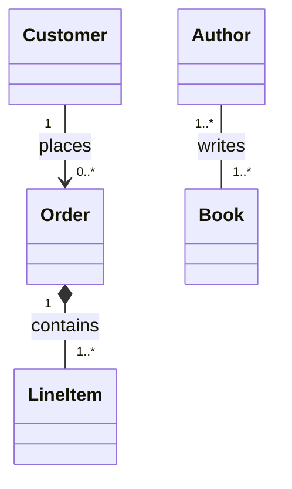

**Common multiplicities:**
- `1` - Exactly one
- `0..1` - Zero or one
- `0..*` or `*` - Zero or many
- `1..*` - One or many
- `m..n` - Between m and n

## Relationship Labels

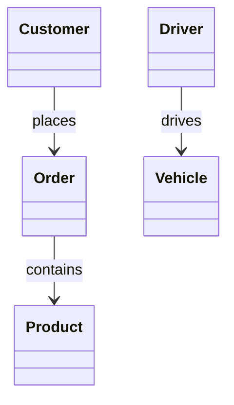

## Class Stereotypes

Mark special class types:

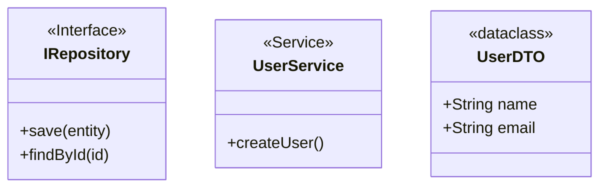

Mermaid recognizes these annotations only in the exact forms `<<Interface>>`,
`<<Abstract>>`, `<<Service>>`, and `<<Enumeration>>`; any other text inside `<< >>` (for
example `<<dataclass>>` or `<<entity>>`) renders as a plain label.

## Abstract Classes and Methods

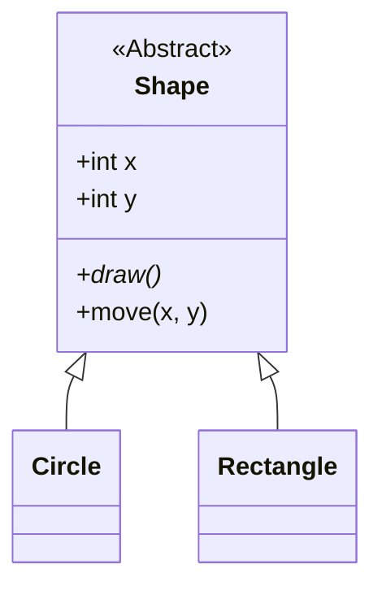

## Generic Classes

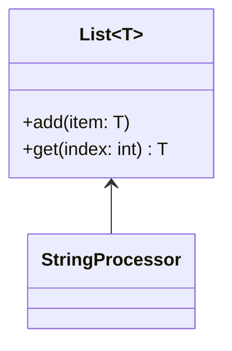

## Namespaces (v11.0.0+)

Group related classes:

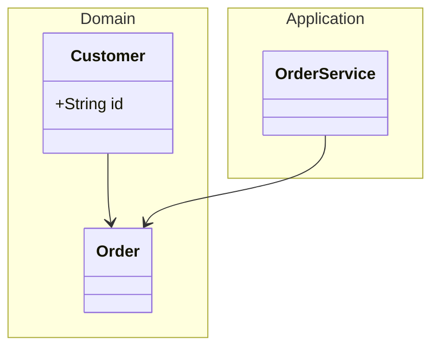

## Comprehensive Example: E-Commerce Domain

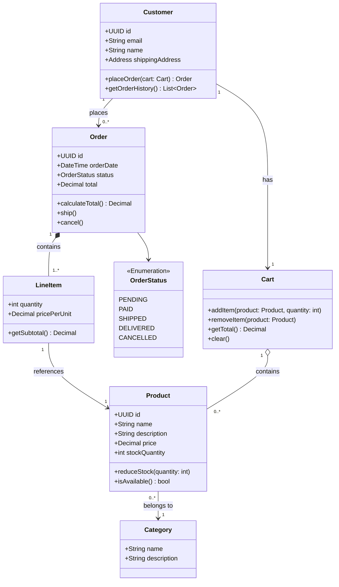

## Domain-Driven Design Patterns

### Entities
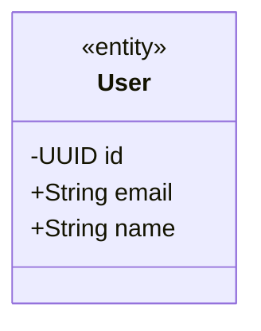

### Value Objects
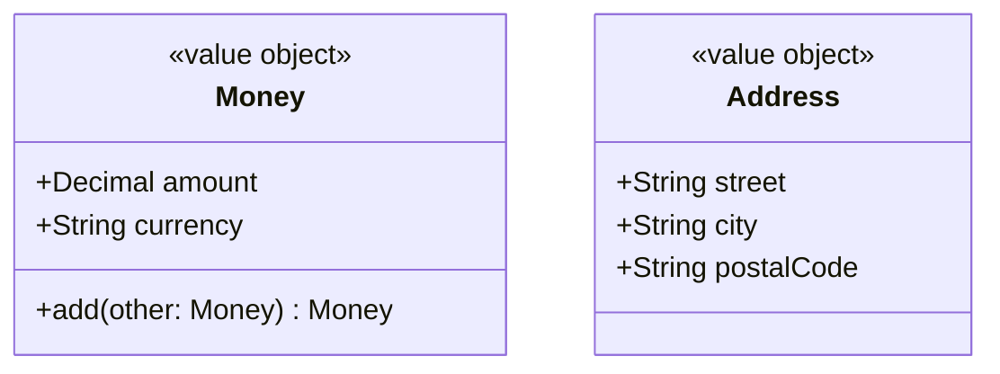

### Aggregates
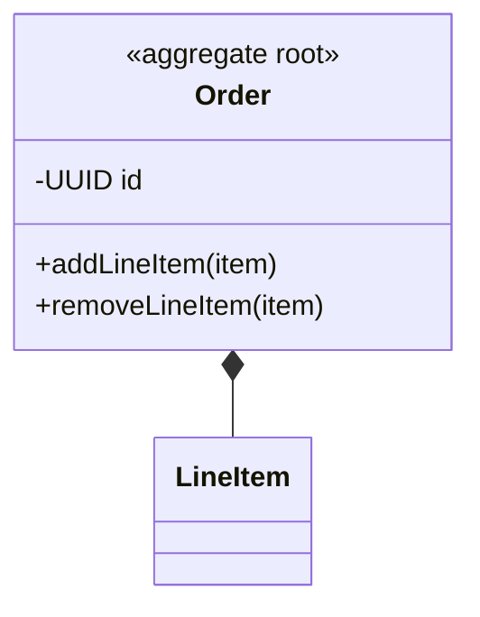

## Tips for Effective Class Diagrams

1. **Start with core entities** - Add attributes and methods incrementally
2. **Show only relevant details** - Omit obvious getters/setters unless important
3. **Use appropriate relationships** - Choose between association, aggregation, and
   composition carefully
4. **Add multiplicity** - Clarifies how many instances participate
5. **Group related classes** - Use notes or visual proximity
6. **Document invariants** - Use notes to explain business rules
7. **Set a direction** - `direction TB` or `direction LR` at the top of the diagram controls
   layout when the renderer supports it
8. **Hide empty member boxes** - Pass `class: { hideEmptyMembersBox: true }` in the diagram
   config (see `advanced-features.md`) to drop the member box from classes without members

## Common Patterns

### Repository Pattern
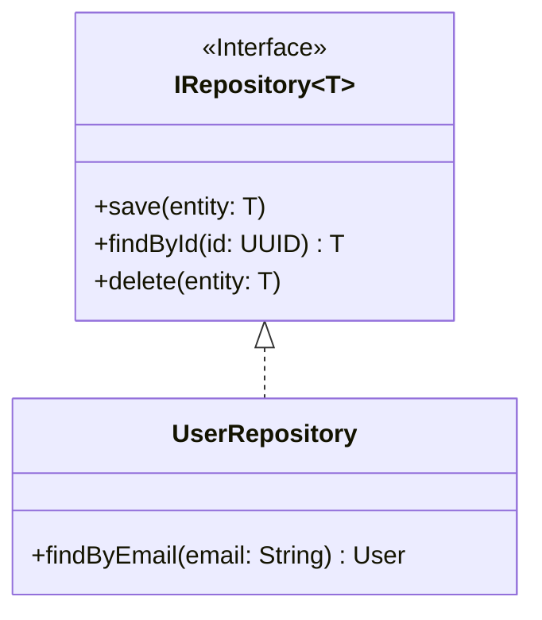

### Factory Pattern
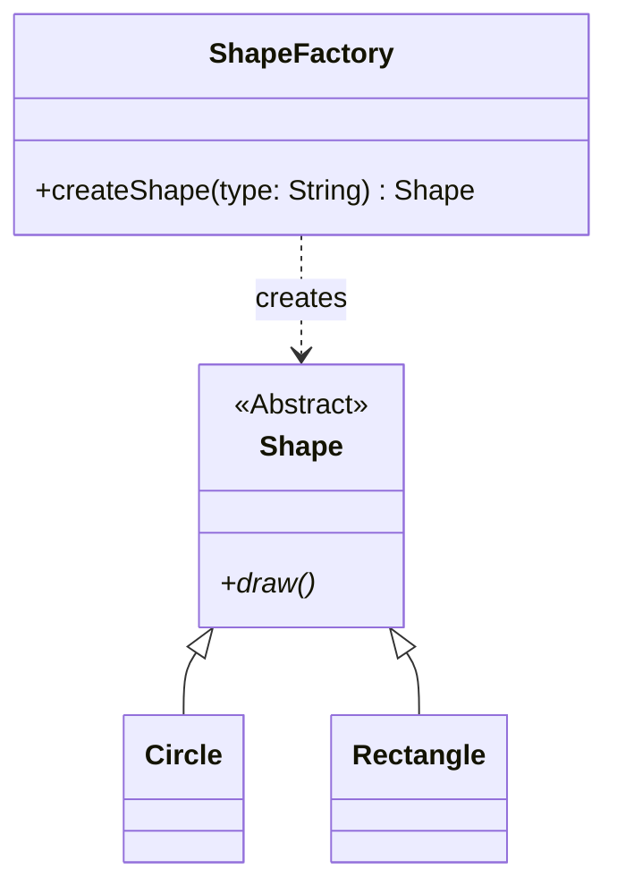

### Strategy Pattern
```mermaid
classDiagram
    class PaymentProcessor {
        -PaymentStrategy strategy
        +setStrategy(strategy: PaymentStrategy)
        +processPayment(amount: Decimal)
    }
    
    class PaymentStrategy {
        <<Interface>>
        +pay(amount: Decimal)*
    }
    
    PaymentStrategy <|.. CreditCardPayment
    PaymentStrategy <|.. PayPalPayment
    PaymentProcessor --> PaymentStrategy
```
