# Sequence Diagrams

Sequence diagrams show interactions between participants over time. They're ideal for API
flows, authentication sequences, and system component interactions.

## Basic Syntax

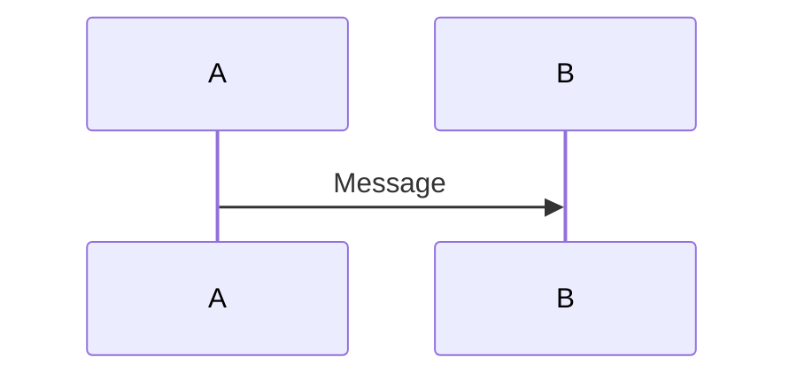

> The word `end` on its own in message text can break parsing. Wrap it in parentheses,
> brackets, or quotes when it appears inside a message label (e.g. `(end)`, `[end]`, or
> `"end"`).

## Participants and Actors

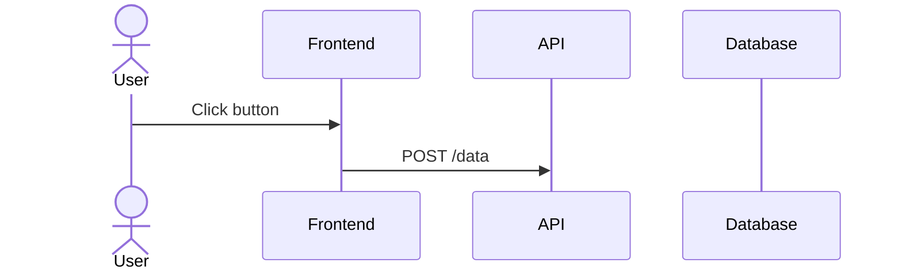

**Difference:**
- `participant` - System components (services, classes, databases)
- `actor` - External entities (users, external systems)

Some renderers also accept specialized participant kinds (for example `database`), but
support varies, prefer `participant` and `actor` for portability.

### Creating and Destroying Participants (v10.3.0+)

An actor or participant can be created, and later destroyed, by a message:

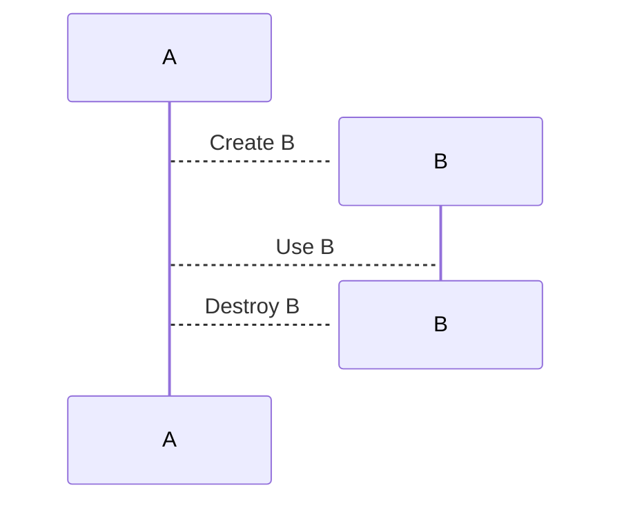

Only the recipient of a message can be created; either side can be destroyed.

## Message Types

### Solid Arrow (Synchronous)
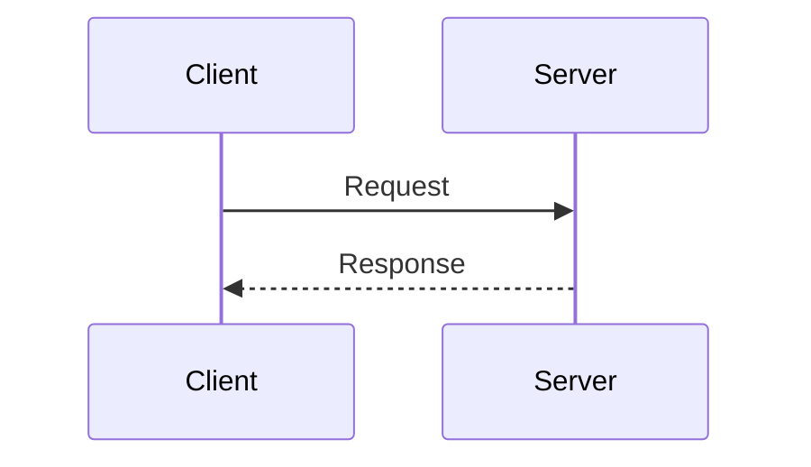

- `->>`  Solid arrow (request)
- `-->>`  Dotted arrow (response/return)

### Open Arrow (Asynchronous)
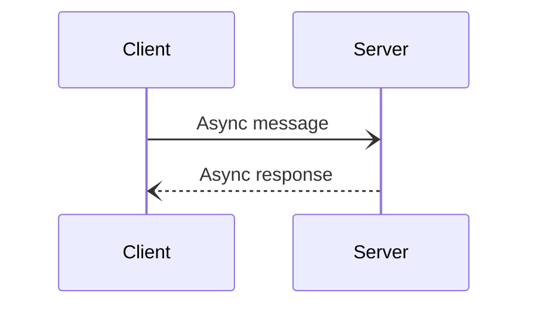

- `-)` Solid open arrow
- `--)` Dotted open arrow

### Cross/X (Delete)
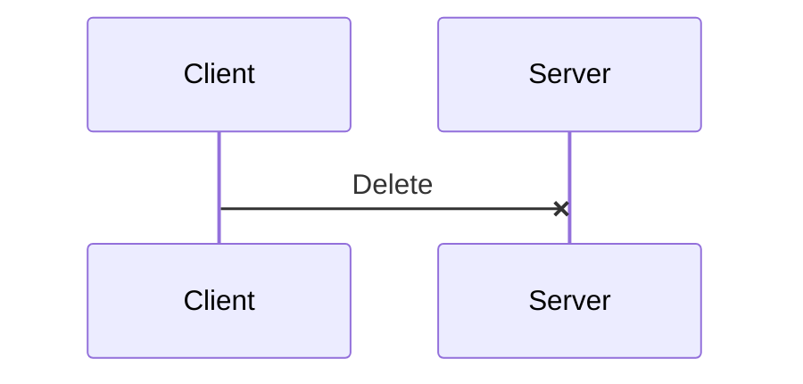

- `-x` Solid line with a cross at the end
- `--x` Dotted line with a cross at the end

### Bidirectional Arrows (v11.0.0+)

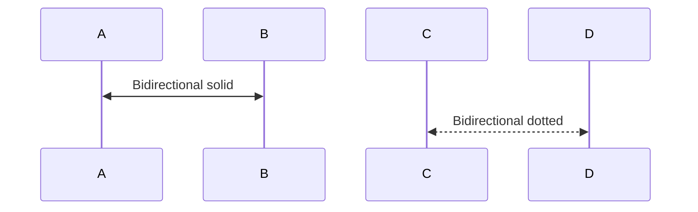

- `<<->>` Solid line with bidirectional arrowheads
- `<<-->>` Dotted line with bidirectional arrowheads

## Activations

Show when a participant is actively processing:

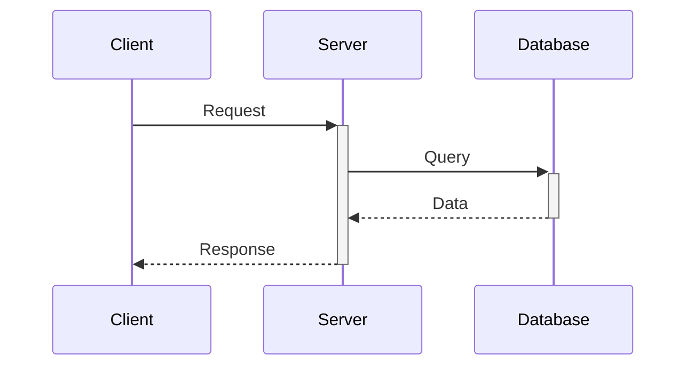

- `+` after arrow activates
- `-` before arrow deactivates

## Alt/Else (Conditional Logic)

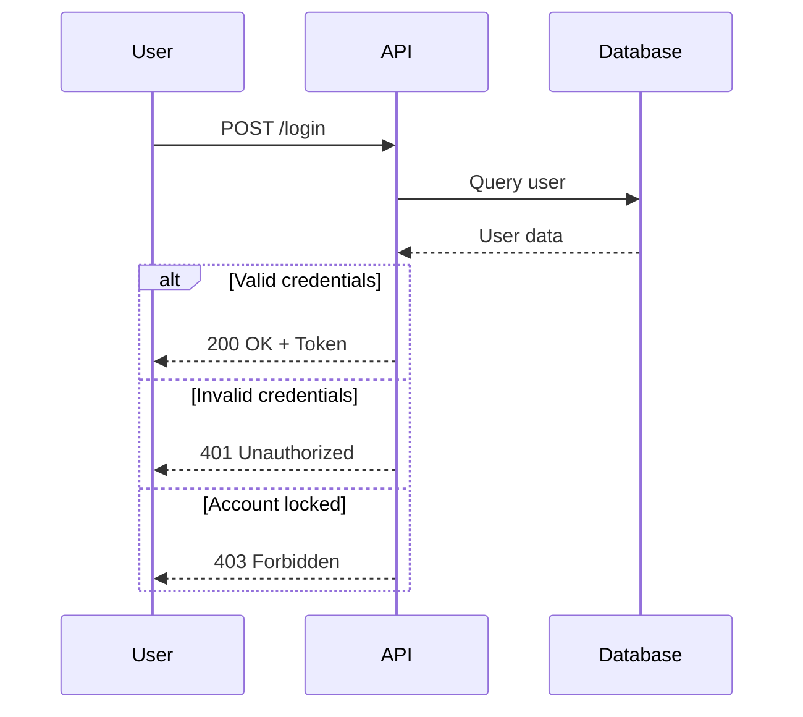

## Opt (Optional)

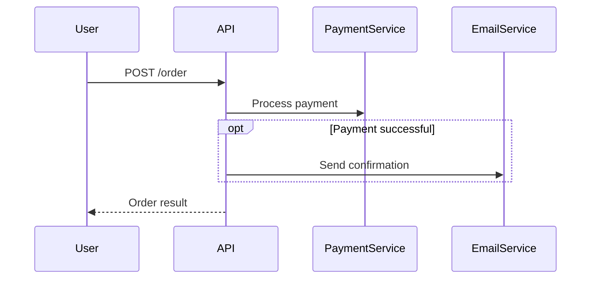

## Par (Parallel)

Show concurrent operations:

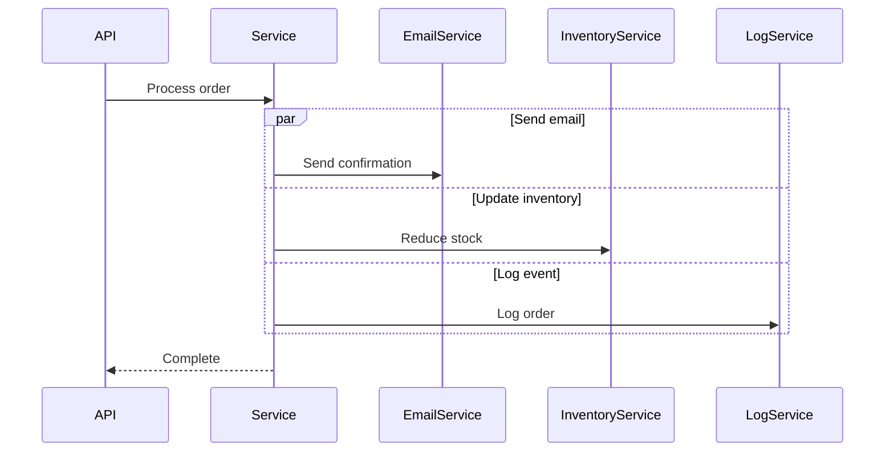

## Loop

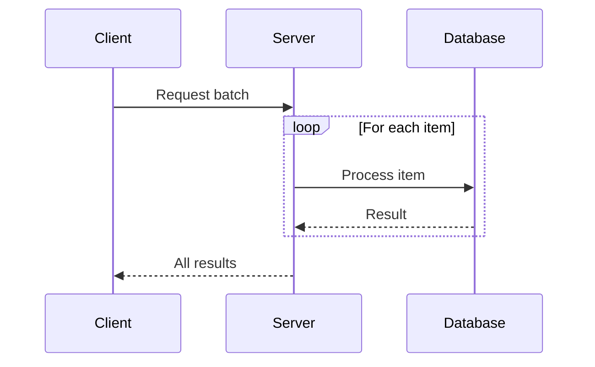

**Loop with condition:**
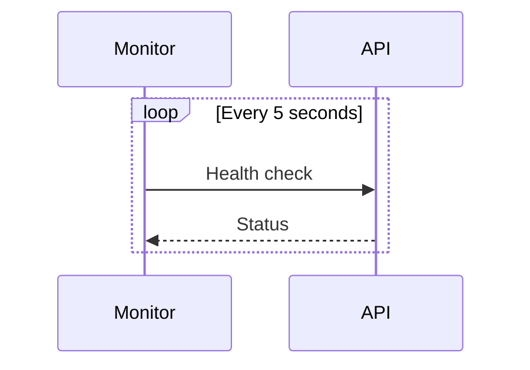

## Break (Early Exit)

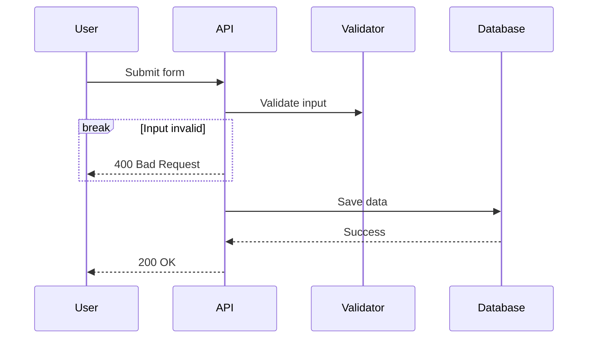

## Critical Region

Force certain steps and handle exceptional circumstances:

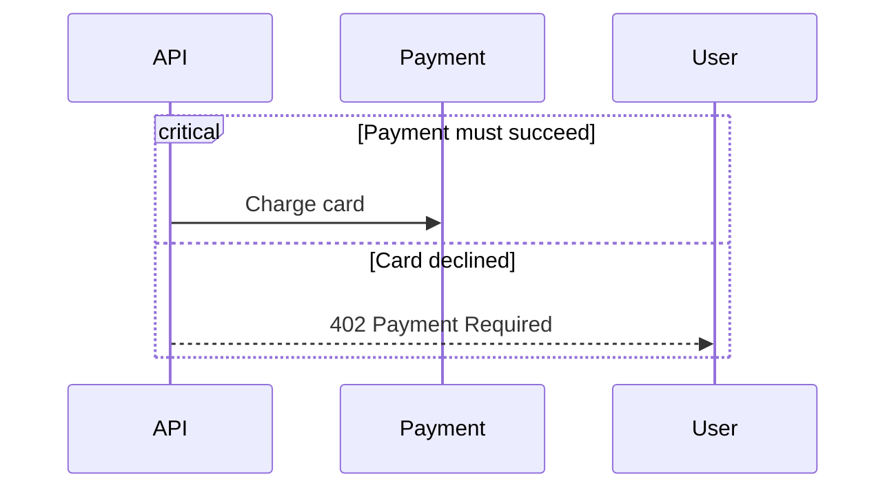

Critical blocks can be nested and can also have no options.

## Background Highlighting

Highlight a flow span with a colored rectangle:

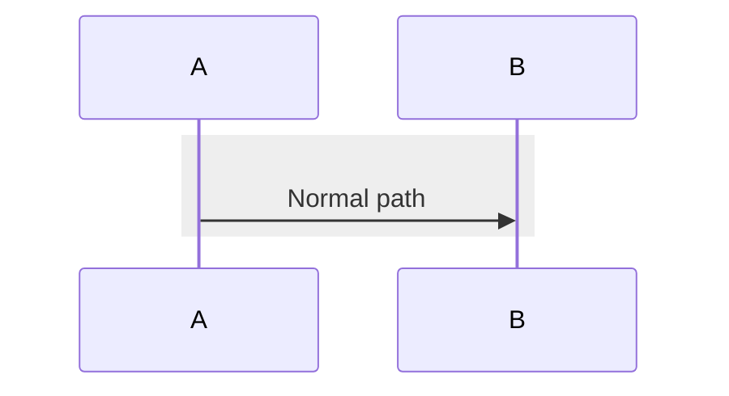

Colors use `rgb`, `rgba`, `hsl`, and `hsla` notation.

## Notes

### Note over single participant
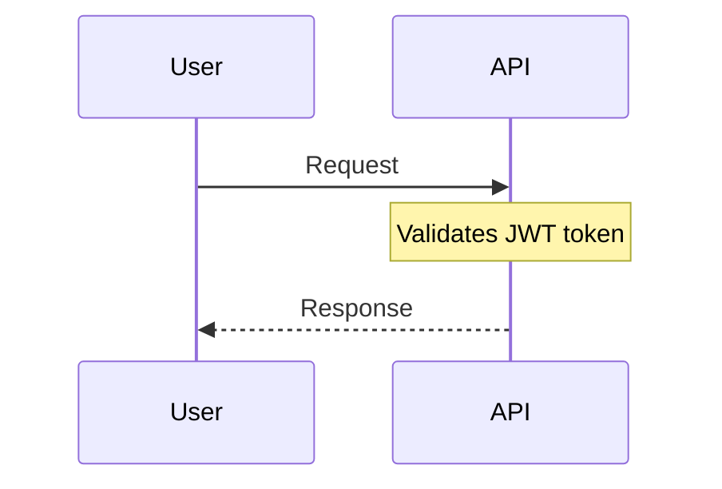

### Note spanning participants
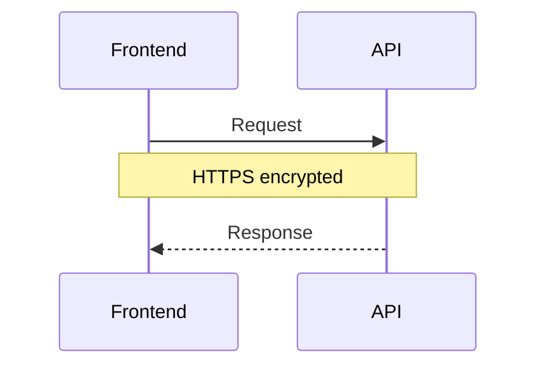

### Right/Left notes
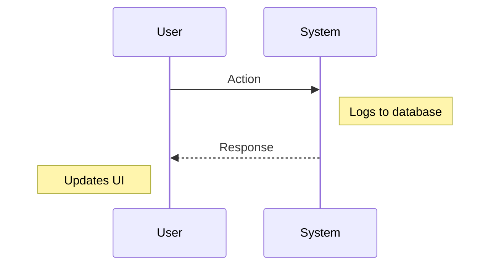

## Sequence Numbers

Automatically number messages:

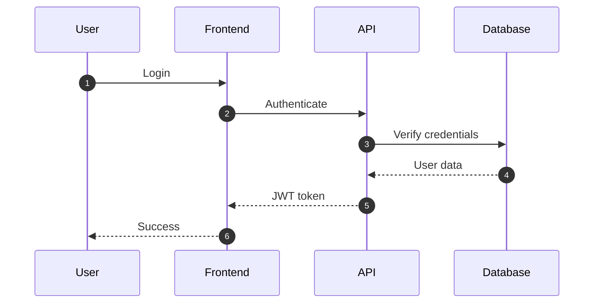

`autonumber <start> <increment>` (v11.15.0+) sets a custom start and step, e.g.
`autonumber 10 5` numbers 10, 15, 20, and so on.

## Links and Tooltips

Add clickable links:

```mermaid
sequenceDiagram
    participant A as Service A
    participant B as Service B
    link A: Dashboard @ https://dashboard.example.com
    link A: API Docs @ https://docs.example.com
    
    A->>B: Message
```

### Grouping (Boxes)

Group related participants in vertical boxes:

```mermaid
sequenceDiagram
    box Aqua Frontend
        participant UI
        participant Store
    end
    box Backend
        participant API
        participant DB
    end
    UI->>API: Query
```

The first word inside a `box` line is an optional color (`rgb`, `rgba`, `hsl`, `hsla`, or a
color name), then an optional label. Hex colors are not supported because `#` starts a comment.

## Comprehensive Example: User Authentication Flow

```mermaid
sequenceDiagram
    autonumber
    actor User
    participant Frontend
    participant AuthAPI
    participant Database
    participant Redis
    participant EmailService
    
    User->>+Frontend: Enter credentials
    Frontend->>+AuthAPI: POST /auth/login
    
    AuthAPI->>+Database: Query user by email
    Database-->>-AuthAPI: User record
    
    alt User not found
        AuthAPI-->>Frontend: 404 User not found
        Frontend-->>User: Show error
    else User found
        AuthAPI->>AuthAPI: Verify password hash
        
        alt Invalid password
            AuthAPI->>Database: Increment failed attempts
            
            opt Failed attempts > 5
                AuthAPI->>Database: Lock account
                AuthAPI->>EmailService: Send security alert
            end
            
            AuthAPI-->>Frontend: 401 Invalid credentials
            Frontend-->>User: Show error
        else Valid password
            AuthAPI->>AuthAPI: Generate JWT token
            AuthAPI->>+Redis: Store session
            Redis-->>-AuthAPI: Confirm
            
            par Update login metadata
                AuthAPI->>Database: Update last_login
            and Track analytics
                AuthAPI->>Database: Log login event
            end
            
            AuthAPI-->>-Frontend: 200 OK + JWT token
            Frontend->>Frontend: Store token in localStorage
            Frontend-->>-User: Redirect to dashboard
            
            opt First login
                EmailService->>User: Welcome email
            end
        end
    end
```

## API Request/Response Example

```mermaid
sequenceDiagram
    autonumber
    participant Client
    participant Gateway
    participant AuthService
    participant UserService
    participant Database
    
    Client->>+Gateway: GET /api/users/123
    Note over Gateway: Rate limiting check
    
    Gateway->>+AuthService: Validate JWT
    AuthService->>AuthService: Verify signature
    
    alt Token invalid or expired
        AuthService-->>Gateway: 401 Unauthorized
        Gateway-->>Client: 401 Unauthorized
    else Token valid
        AuthService-->>-Gateway: User context
        
        Gateway->>+UserService: GET /users/123
        UserService->>+Database: SELECT * FROM users WHERE id=123
        Database-->>-UserService: User record
        
        alt User not found
            UserService-->>Gateway: 404 Not Found
            Gateway-->>Client: 404 Not Found
        else User found
            UserService-->>-Gateway: 200 OK + User data
            Gateway-->>-Client: 200 OK + User data
        end
    end
```

## Microservices Communication

```mermaid
sequenceDiagram
    actor User
    participant Gateway
    participant OrderService
    participant PaymentService
    participant InventoryService
    participant NotificationService
    participant MessageQueue
    
    User->>+Gateway: POST /orders
    Gateway->>+OrderService: Create order
    
    OrderService->>+InventoryService: Check stock
    InventoryService-->>-OrderService: Stock available
    
    break Insufficient stock
        OrderService-->>Gateway: 400 Out of stock
        Gateway-->>User: Error message
    end
    
    OrderService->>OrderService: Reserve order
    OrderService->>+PaymentService: Charge customer
    
    alt Payment successful
        PaymentService-->>-OrderService: Payment confirmed
        OrderService->>MessageQueue: Publish OrderConfirmed event
        
        par Async processing
            MessageQueue->>InventoryService: Reduce stock
        and
            MessageQueue->>NotificationService: Send confirmation
            NotificationService->>User: Email confirmation
        end
        
        OrderService-->>-Gateway: 201 Created
        Gateway-->>User: Order confirmed
    else Payment failed
        PaymentService-->>OrderService: Payment declined
        OrderService->>OrderService: Release reservation
        OrderService-->>Gateway: 402 Payment Required
        Gateway-->>User: Payment failed
    end
```

## Best Practices

1. **Order participants logically** - Typically: User → Frontend → Backend → Database
2. **Use activations** - Shows when components are actively processing
3. **Group related logic** - Use alt/opt/par to organize conditional flows
4. **Add descriptive notes** - Explain complex logic or important details
5. **Keep diagrams focused** - One scenario per diagram
6. **Number messages** - Use autonumber for complex flows
7. **Show error paths** - Document failure scenarios with alt/else
8. **Indicate async operations** - Use open arrows for fire-and-forget messages

## Common Use Cases

### Authentication
- Login flows
- OAuth/SSO flows
- Token refresh
- Password reset

### API Operations
- CRUD operations
- Search and filtering
- Batch processing
- Webhook handling

### System Integration
- Microservice communication
- Third-party API calls
- Message queue processing
- Event-driven architecture

### Business Processes
- Order fulfillment
- Payment processing
- Approval workflows
- Notification chains
