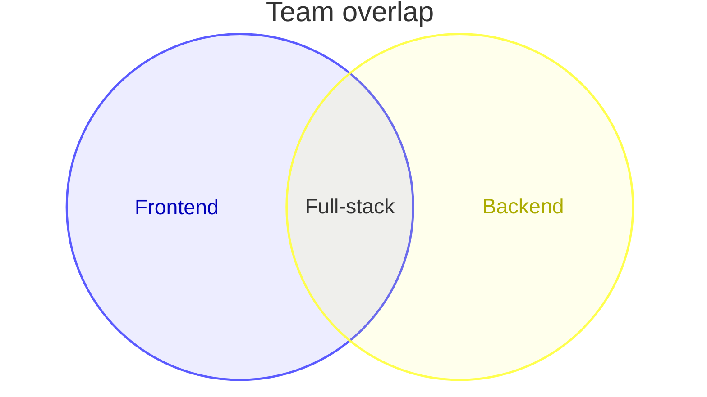
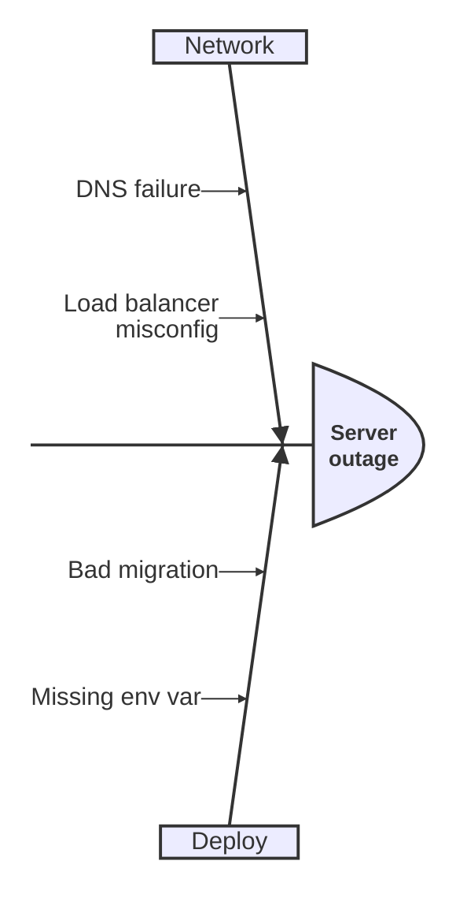
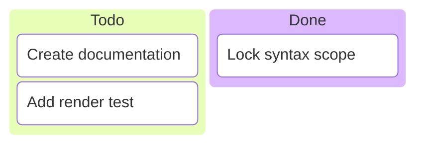
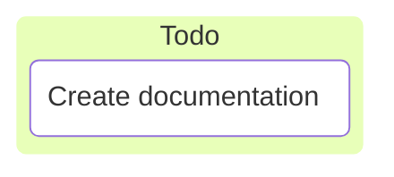
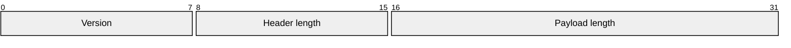
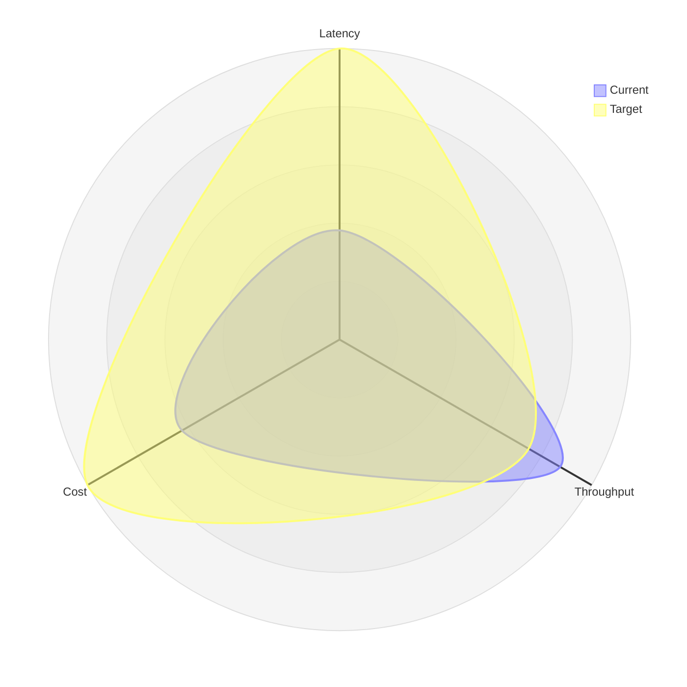
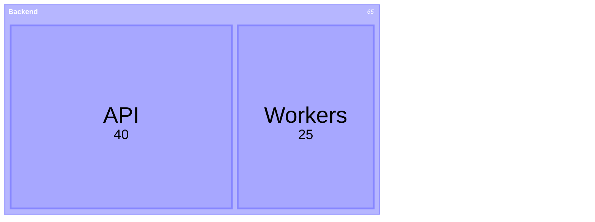

# New and Specialized Diagrams

Covers diagram types outside the core flowchart, sequence, class, ER, C4, state, git, gantt, and pie set. Verified against Mermaid 12.0.0 docs. Beta types can change syntax in later releases, so check the target renderer before using them in persistent docs.

## Compatibility rule

- Stable types (`mindmap`, `timeline`, `journey`, `sankey`, `kanban`, `packet`, `block`, `quadrantChart`, `requirementDiagram`, `xychart`, `treemap`): prefer for README, wiki, and PR docs. Still verify the target renderer.
- Beta types (`venn-beta`, `ishikawa-beta`, `architecture-beta`, `radar-beta`): use for exploration or version-pinned docs only. For long-lived docs, provide a flowchart fallback or pin the Mermaid version in frontmatter or project config.
- If the renderer is unknown, stay with flowchart, sequence, or a Markdown table.

## Venn diagrams (v11.12.3+)

Show overlap between sets. Keyword is `venn-beta`.

Rules:

- Declare each set with `set` before it appears in a `union`.
- Identifiers are bare words (`A`, `Set_1`) or quoted strings (`"Foo Bar"`). Display label goes in brackets (`A["Alpha"]`).
- `union` accepts two or more sets. Pairwise regions render automatically for three-way unions.
- Size with `:N` suffix: `set A["Alpha"]:20`.
- Place inner labels with `text`, indented under the parent set or union.
- Style with `style A,B fill:#E8F4FD,stroke:#0072B1`.

Use for: skill overlap, responsibility overlap, product positioning at an intersection. Keep to two or three sets.

## Ishikawa diagrams (v11.12.3+)

Show causes leading to one effect. Also called fishbone or cause-effect. Keyword is `ishikawa-beta`.

Rules:

- First line is the effect or problem.
- Indentation defines the fishbone structure. Each level is a cause group.
- Keep labels short. Put analysis detail in surrounding prose, not in the diagram.

Use for: incident review, root cause analysis, quality docs.

## Kanban

Show work stages and tasks. Keyword is `kanban`.

Rules:

- Columns use `columnId[Column Title]`. Tasks sit indented under a column as `taskId[Task Description]`.
- IDs must be unique within the diagram.
- Task metadata uses `@{ assigned: "name", ticket: "123", priority: "High" }`. Allowed priority values are `Very High`, `High`, `Low`, `Very Low`.
- Link tickets with frontmatter:

Use for: sprint board snapshot, workflow handoff. Not a replacement for an issue tracker.

## Packet diagrams (v11.0.0+)

Show network packet layout by bit range. Keyword is `packet`.

Rules:

- Each line after `packet` is `start-end: "Label"`. Single-bit fields use `start: "Label"`.
- From v11.7.0, `+N: "Label"` continues from the end of the previous field. Mixing explicit ranges and `+N` is allowed.
- Keep labels quoted. Document field semantics in prose.

Use for: protocol docs, driver or firmware specs.

## Radar diagrams (v11.6.0+)

Compare entities across dimensions. Keyword is `radar-beta`.

Rules:

- Define axes with `axis`, curves with `curve` plus a value list.
- Control scale with `max`, `min`, `graticule`, and legend with `showLegend`.
- Keep axis count low. More than six axes is hard to read.

Use for: trade-off comparison, benchmark summary. For precise numbers, pair with a table.

## Treemap

Show hierarchical proportions as nested rectangles. Keyword is `treemap`.

Rules:

- Parents use quoted text. Leaves use `"Name": value`.
- Indentation defines hierarchy.
- Style with `:::class` and `classDef`. Tune with `padding`, `diagramPadding`, `showValues`, and `valueFormat`.

Use for: repo size breakdown, cost allocation, hierarchical capacity.

## Other stable types worth knowing

| Need | Keyword | Notes |
|---|---|---|
| Brainstorm hierarchy | `mindmap` | Indented topics under one root. Keep depth shallow. |
| Project phases on a calendar | `timeline` | Use when order plus dates matter. For dependencies, prefer `gantt`. |
| User experience over time | `journey` | Sections plus scored tasks. Keep scores consistent. |
| Flow volume between stages | `sankey` | Use when width should reflect quantity. |
| Block layout | `block-beta` | Columns and spans for system placement. |
| Priority matrix | `quadrantChart` | Four-quadrant positioning. Label axes explicitly. |
| Contractual needs | `requirementDiagram` | Requirements, elements, and trace links. |
| Bar and line comparison | `xychart` | Title, `x-axis`, `y-axis`, then `bar` or `line`. Less portable than tables, verify renderer. |

If unsure between two types, read `diagram-type-selection.md` before writing syntax.

## Sources

Primary sources checked for this reference:

- https://mermaid.js.org/intro/
- https://mermaid.js.org/syntax/venn.html
- https://mermaid.js.org/syntax/ishikawa.html
- https://mermaid.js.org/syntax/kanban.html
- https://mermaid.js.org/syntax/packet.html
- https://github.com/mermaid-js/mermaid
- https://mermaid.live for manual render checks on non-confidential diagrams

For radar, treemap, mindmap, timeline, journey, sankey, and block syntax, start from the Syntax sidebar at https://mermaid.js.org/ and match the exact keyword and version note on that page. Do not rely on memory when the page lists a `-beta` suffix or a minimum version.
